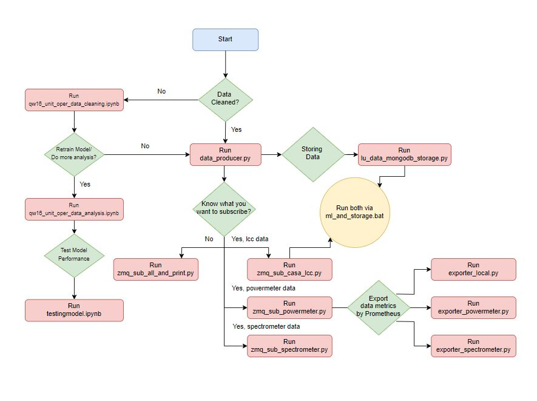

# Raw laser unit operational data analysis

This repo involves reading and cleaning raw data files, uploading them to a local MongoDB database (localhost:27017), performing data analysis to derive CSV files for Laser Units and Power Supply Units, and creating an Isolation Forest model to detect anomalies. Mock real-time data feeding is adopted for now to act as hardware, for ML prediction and feedback as well as data visualization on Prometheus and Grafana for now.

### Project Overview

1. **Data Exploration and Cleaning**
   - Data is read from raw files and cleaned using the `qw16_unit_oper_data_cleaning.ipynb` notebook.
   - Cleaned data is then uploaded to MongoDB through a batch file (manual upload is possible).

2. **Data Analysis**
   - Analysis is performed using the `qw16_unit_oper_data_analysis.ipynb` notebook.
   - Data is extracted from MongoDB to derive two CSV files:
     - **Laser Unit**: `lxx_data.csv`
     - **Power Supply Unit**: `psu_data.csv`
   - Further data filtering is applied to create an Isolation Forest model to detect anomalies.
   - CSV and pickle files created along the way are all store within `Created_files` folder
   - The model is stored in `Created_files/best_isolation_forest_model.pkl` and tested using the `testingmodel.ipynb` notebook.

3. **Metrics Exporting**
   - Integrating Database with Prometheus by collecting and exporting real-time metrics. 
   - It continuously monitors the MongoDB collection and makes this information available for Prometheus to scrape, allowing for effective monitoring and alerting.

4. **Data Simulation**
   - The `real_time_simulation.py` script sends data rows to a temporary collection within the MongoDB database in real-time to simulate future operations.
   - Prometheus handles system-level monitoring and metric collection.
   - Grafana visualizes the metrics collected by Prometheus.

5. **Data Producer**
   - The `data_producer.py` script uses the unseen `no_psu_with_fake_data_df_test.pkl` to further create another 16units worth of data by randomly picking a data row and renames it to form 32units worth of datapoints. This is then further duplicated into another 32units to simulate data feeding from LCC1 and LCC2. All date_time values are updated to current. 
   - `/casa_lcc_data` route is defined with `@app.route('/casa_lcc_data', methods=['GET'])`. When accessed via GET request, it returns the stored_payload as JSON if available, otherwise returns a "No payload available" message.
   - The simple Flask application created acts as a web server that continuously generates and serves simulated real-time data in JSON format. It uses threading for continuous data updates and handles graceful shutdowns.

6. **Machine Learning Prediction and Feedback**
   - The `zmq_sub_casa_lcc.py` script initializes a ZeroMQ context and creates a subscriber/publisher socket that connects to `tcp://127.0.0.1:5556` / `tcp://127.0.0.1:5555` respectively.
   - The `anomaly_detection_and_publish` function performs anomaly detection using the pre-trained machine learning model (`best_isolation_forest_model.pkl`).It then publishes the problematic laser units back via the publisher socket.

7. **Data Storage**
   - Unlike `real_time_simulation.py`, the `lu_data_mongodb_storage.py` script separates data storage from ML prediction and feedback. This compartmentalization aims to enhance code clarity by isolating functionalities, and help to pinpoint issues when errors occur.
   
<hr>

### Knowledge: Isolation Forest for Anomaly Detection

Isolation Forest is utilized for anomaly detection as it is particularly well-suited for identifying outliers in datasets. It is an unsupervised learning algorithm, meaning it does not require labeled training data which this project does not have. Instead, it works by isolating observations, and anomalies are isolated faster than normal points in the data.

This algorithm assigns an anomaly score to each data point, with labels of 1 indicating normal observations and -1 indicating anomalies. This inherent scoring system helps in distinguishing between normal behavior and anomalies effectively.
Isolation Forest is advantageous because it can handle high-dimensional data, requires fewer assumptions about the data distribution, and is computationally efficient, making it ideal for real-time applications.

During training,  GridSearch is used to fine-tune the hyperparameters of the Isolation Forest model, including model__n_estimators, model__max_samples, model__contamination, and model__max_features. The aim is to maximize the precision score, and at the same time minimize false positives (False Positive / False Positive + True Negative). This approach ensures that potential faults are not overlooked, which is crucial for effective Product Health Management.

**Hyperparameter Tuning with GridSearch**
During training, GridSearch is used to fine-tune the hyperparameters of the Isolation Forest model using the following parameter grid:
- `model__n_estimators`: [100, 200, 300]
  Number of trees in the Isolation Forest. Increasing the number of trees generally improves model performance.

- `model__max_samples`: ['auto', 0.8, 0.6]
  Fraction of samples used to train each tree. This parameter helps balance model robustness and training speed.

- `model__contamination`: [0.2, 0.3, 0.4]
  Expected proportion of anomalies in the data. This parameter adjusts the sensitivity of the anomaly detection.

- `model__max_features`: [1.0, 0.8, 0.6]
  Fraction of features used for training each tree. This controls the diversity of features considered by each tree.

- `Scoring`: precision
The aim is to maximize the precision score, minimizing false positives (i.e., False Positives / (False Positives + True Negatives)). This approach ensures that potential faults are not overlooked, which is crucial for effective Product Health Management.

Critical Stats Of The Model:
- Accuracy: 0.8059653363943523
- False Positive Rate (FPR): 0.01649256786996391
- False Negative Rate (FNR): 0.24208057928439825

**Potential tools to evaluate the model performance in production environment**
- To observe metrics such as Model Accuracy,Inference Latency, Error Rates

   1. `Prometheus` (In-Use)
   - Free, highly customizable, and powerful
   - Track model performance simultaneously with collecting and storing of time-series data

   2. `MLflow` (New) 
   - Tracks metrics, parameters, and artifacts, allowing monitoring of model performance metrics like accuracy, precision, recall, and loss.
   - Provides a user-friendly web interface where you can visualize metrics and compare different runs or models. 

<hr>

### Good Practices in Machine Learning Development [CRISP-ML(Q)](https://ml-ops.org/content/crisp-ml)

This project acknowledges the importance of structured approaches in machine learning development, such as the CRISP-ML(Q) methodology (Cross-Industry Standard Process for Machine Learning with Quality Assurance) in order to systematically organize our ML workflow and ensure quality at each stage, so that we can deliver more reliable, and maintainable machine learning solutions.

Following the CRISP-ML(Q) methodology can help our project flow in numerous ways:

   1. Alignment with Business Goals: Starting with business understanding ensures the ML project stays aligned with actual business objectives, in our project's case will be to enhance predictive analytics.
   2. Structured Approach: It provides a systematic framework for organizing machine learning workflow, from business understanding to monitoring and maintenance.
   3. Quality Assurance: At each phase, it emphasizes defining requirements, constraints, and potential risks, helping us proactively address quality issues. This is extremely important for us as an R&D firm since we have many constraints and limitations.
   4. Reproducibility: By encouraging documentation of processes, data, and models, it improves the reproducibility of model's results, or even further refine it by another user without much guidance. 
   5. Tool Selection Guidance: When we clearly are able to define the requirements and objectives at each stage, it helps us identify the most suitable tools that align with your project needs, ensuring a more effective and efficient workflow. 

<hr>

### Deliverables 

- Files to be ran
1. `real_time_simulation.py`
   - Purpose: Simulates real-time data feeding into MongoDB.
   - Usage: Execute this script to send data rows to MongoDB for real-time operation simulation.

2. `exporter_local.py`
   - Purpose: Exports real-time metrics from MongoDB to Prometheus.
   - Usage: Run this script to collect and export metrics from the MongoDB collection for Prometheus scraping.
   - Note: To input the names of the desired database and collection when scipt is being ran (Check MongoDB for existing or make new database/collection)

3. `data_producer.py`
   - Purpose: Act as mock LCC hardware to produce 2 X 32 Laser Units' datapoints, comprises of actual datapoints and synthetic data points.
   - Usage: Run this script to enable C++ side to receive the mock data for manipulation and to kick start the data flow.

4. `zmq_sub_casa_lcc.py`
   - Purpose: Subscribes to ZeroMQ broker, extract the data to run IsolationForest Model and publishes an array of indices of laser units with anomalies detected as messages.
   - Usage: Run this script using `ml_and_storage.bat` to simulate the anomaly feedback and storage at the same time.

5. `lu_data_mongodb_storage.py`
   - Purpose: Subscribes to ZeroMQ broker, extract the data to run IsolationForest Model and sends the datapoint to database. 
   - Usage: Run this script using `ml_and_storage.bat` to simulate the anomaly feedback and storage at the same time.


- Files to be viewed (As output is provided under folder `Created_files`)
1. `NLA_analysis.ipynb`
   - Purpose: Conducts Exploratory Data Analysis (EDA) on hand-input data from 16 laser units to understand underlying trends and correlations.
   - Usage: Explore trends and correlations to gain a better understanding of the dataset, especially without prior domain knowledge.
   - Output: Visualizations and analyses within the notebook to uncover patterns and relationships in the data.

2. `qw16_unit_oper_data_cleaning.ipynb`
   - Purpose: Reads and cleans raw data files before appropriate formatting.
   - Usage: Run this notebook to clean and format raw date before pushing to database.
   - Output: Cleaned data files uploaded to MongoDB.

3. `qw16_unit_oper_data_analysis.ipynb`
   - Purpose: Pulls and analyses data rows of Laser Units and Power Supply Units from database, before eventually creating an Isolation Forest model for anomaly detection.
   - Usage: Run this notebook to visualise `lxx_data.csv`, `psu_data.csv`, and further tune best_isolation_forest_model.pkl.
   - Output: CSV files from database and the trained model stored in the folder, along with several pickle files to store intermediate progress.

4. `flask_dash_simulation.py`
   - Purpose: A tryout script that sets up a web application using Flask and Dash to display real-time data with anomaly prediction, before integrating with C++
   - Usage: Run this script to see how a table of 32 laser units data periodically updates new data every 5 seconds, applies anomaly detection, and highlights anomalies.
   - Output: Web-based dashboard that displays real-time data with anomaly predictions on `http://localhost:8050`.

<hr>

### Prometheus, Grafana, Tableau && MongoDB Startup
1. Starting Prometheus Server
   - Locate downloaded prometheus folder `prometheus-2.52.0.windows-amd64`, and ensure the following is added under `scrape_configs`
   ```
      - job_name: "mongodb"
         static_configs:
         - targets: ["localhost:9216"]
   ```
   -  Afterwards, run `prometheus.exe` within the folder.

2. Starting Grafana Server
   - Locate downloaded grafana folder, follow the path of `grafana-enterprise-11.0.0.windows-amd64\grafana-v11.0.0\conf` and ensure within `prometheus.yml`:
   ```
      http_port == 3001
   ```
   - Afterwards, follow the path of `grafana-enterprise-11.0.0.windows-amd64\grafana-v11.0.0\bin` and run `grafana-server.exe`.
   - On `http://localhost:3001/`, login using:
      - **Username: tsihao**
      - **Password: admin123**

3. Starting Tableau
   - Start Tableau with search bar
   - Import data by choosing its file type on Tableau main screen

4. Starting MongoDB
   - Locate the `mongodb-windows-x86_64-7.0.11-signed.msi`, run to install MongoDB on Windows system
   - Install MongoDB Compass by running `mongodb-compass-1.43.0-win32-x64.exe`, now we can launch MongoDB Compass from Start menu.


<hr>

### Script Run Order of data production, ML predictions and Database Storage, Data Visualisation

1. Run `data_producer.py`
2. Run `ml_and_storage.bat` 
   - Runs both `zmq_sub_casa_lcc.py` and `lu_data_mongodb_storage.py` with one click
   - Both anomaly detection and data storage will happen simultaneously
   - (Adjust desired database name in `lu_data_mongodb_storage.py`)
3. Run `exporter_local.py`
   - Change the exporter if needed under the folder `Prometheus_client_exporters`. When ran, user will be prompted to key in the name of database and collection that they wish to scrape.
   - Message stating "Prometheus server started on port 9216" is shown, and metrics scrapped is shown on `http://localhost:9216/`
4. View on Grafana and Query



<hr>

### Dependencies

<!-- Don't change this section's name (ie. "Dependencies"), as I'm referencing it in the `lsu` repo. ~Shaun -->

-   Python: https://www.python.org/downloads/#content \
    _(required packages in `requirements.txt`)_
    > We used `v3.12.3`
    > ([link to download that version](https://www.python.org/ftp/python/3.12.3/python-3.12.3-amd64.exe))
    >
    > _**Note:** During installation, add python to PATH env variable._ 

-   Prometheus (portable): https://prometheus.io/download/#prometheus
    > We used `v2.52.0`
    > ([link to download that version](https://github.com/prometheus/prometheus/releases/download/v2.52.0/prometheus-2.52.0.windows-amd64.zip))

-   Grafana Enterprise Edition (portable): https://grafana.com/grafana/download
    > We used `v11.0.0 Standalone Windows Binaries (64 Bit)`
    > ([link to download that version](https://dl.grafana.com/enterprise/release/grafana-enterprise-11.0.0.windows-amd64.zip))

-   MongoDB Community Server: https://www.mongodb.com/try/download/community
    > We used `v7.0.11 MSI Installer`
    > ([link to download that version](https://fastdl.mongodb.org/windows/mongodb-windows-x86_64-7.0.11-signed.msi))

-   MongoDB Compass (GUI): https://www.mongodb.com/try/download/compass
    > We used `v1.43.0 EXE Installer`
    > ([link to download that version](https://downloads.mongodb.com/compass/mongodb-compass-1.43.0-win32-x64.exe))

-   Tableau Public Desktop: https://public.tableau.com
    > We used `v2024.1.3` (no link to installer)
    >
    > _**Note:** You need a Tableau account to download the installer._

-   Jupyter Notebook
    > Installation via pip: `pip install notebook`

<hr>

### Future Plans/Considerations

Switching to InfluxDB

- *Top Choice: InfluxDB*
  - **Similar Data Model**: MongoDB's documents are like InfluxDB's points; collections map to measurements.
  - **SQL-Like Querying**: Easier to learn and use compared to MongoDB's query language.
  - **High Write Performance**: Optimized for frequent, high-load data writes.
  - **Built-In Dashboard**: Refreshes every second; could replace Prometheus/Grafana.

Steps for Switching

1. Install InfluxDB
   - Version used : 2.7.7 ([link to download that version](https://docs.influxdata.com/influxdb/v2/install/?t=Windows+Powershell)).
   - Unzip and run `influxd.exe`.

2. Data Migration
   - Transfer data from MongoDB to InfluxDB, ensuring compatibility and format consistency.

<hr>

### References

1. Liu, F. T., Ting, K. M., & Zhou, Z.-H. (2008). Isolation Forest. In 2008 Eighth IEEE International Conference on Data Mining (pp. 413-422). IEEE.


